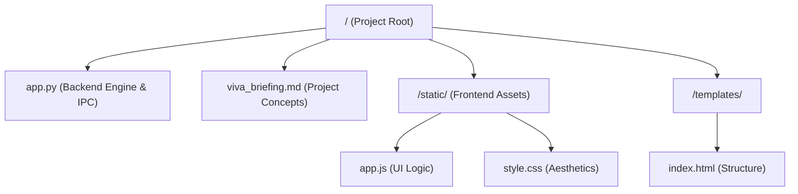
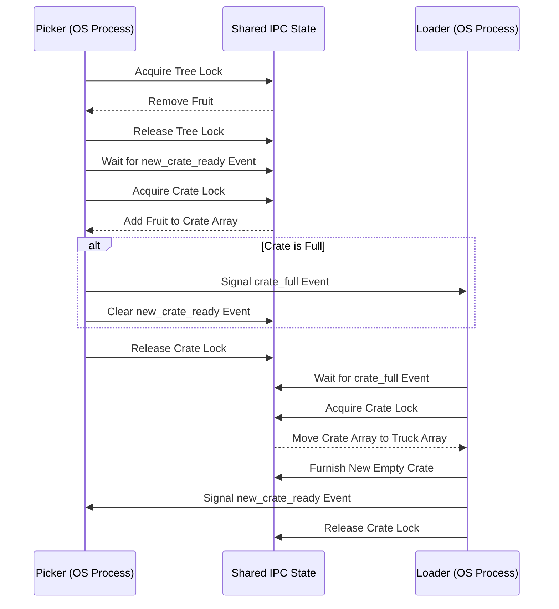

# Complex Engineering Project (CEP) Report

## Project Title: Spring Workers — Fruit Picking Simulation

**Domain:** Operating Systems & Parallel Computing

---

## 1. Executive Summary

The **Spring Workers** simulation is a real-time, web-based demonstration of fundamental Operating System concepts, specifically focused on **Process Synchronization**, **Mutual Exclusion**, and the **Producer-Consumer** pattern. The system simulates a fruit orchard where multiple "Picker" processes harvest fruits and a "Loader" process manages the logistics of shipping them in crates. 

Through the use of strictly isolated OS-level processes, the project demonstrates advanced state-sharing across memory boundaries using Inter-Process Communication (IPC).

---

## 2. Project Architecture & File Structure

The project follows a robust Web-Backend architecture using Python (Flask) for the web server and process management, and Vanilla JavaScript for the event-driven real-time interface.

### 2.1 File Overview



---

## 3. Core OS Concepts Applied

### 3.1 Parallelism & Multiprocessing

The simulation runs true parallel operations utilizing Python's `multiprocessing` library, escaping the Global Interpreter Lock (GIL) limitation:

- **Pickers (P1, P2, P3)**: Three independent OS processes simulating concurrent worker agents.
- **Loader**: A separate logistics OS process.
- **Flask Server & Broadcast Thread**: The main process that manages HTTP traffic, spawns the workers, and routes events via a Queue.

### 3.2 Inter-Process Communication (IPC) & Shared Memory

Because different OS processes do not share memory by default, the project leverages `multiprocessing.Manager()`. This spawns a central server process that holds the actual state (`sim` dictionary, `tree` list, `crate` list) and provides proxies to the Picker and Loader processes so they can safely mutate shared variables.

### 3.3 Mutual Exclusion (Mutex)

To prevent race conditions on the shared IPC resources, `multiprocessing.Lock()` is utilized:

- **Tree Lock**: Only one picker process can pop a fruit from the shared tree array at a time.
- **Crate Lock**: Ensures that multiple picker processes cannot modify the active crate simultaneously.

### 3.4 Signaling & Condition Synchronization

We use `multiprocessing.Event` to coordinate behavior between the isolated processes:

- **`crate_full`**: Signaled by the picker who adds the target fruit, waking up the sleeping Loader process.
- **`new_crate_ready`**: Signaled by the Loader to give paused pickers permission to resume.
- **`all_done`**: Signaled when the tree is bare to trigger the Loader's final cleanup sequence.

---

## 4. Logical Workflow

### 4.1 The Producer-Consumer Pattern

The simulation is an implementation of the Producer-Consumer synchronization problem:

- **Producers**: The Pickers harvest fruits from a shared array (the Tree) and place them into a bounded buffer (the Crate).
- **Consumer**: The Loader takes the full buffer (the Crate) and "consumes" it by moving its contents to the Truck.

### 4.2 Sequence Diagram



---

## 5. Implementation Deep Dive (Backend)

### 5.1 Server-Sent Events (SSE) and The Message Queue

**What is SSE?** Server-Sent Events allow a server to push real-time updates to the web browser over a single HTTP connection. 

**Why was it used?** It avoids UI polling overhead. SSE streams UI events smoothly (e.g., "fruit picked", "crate locked") exactly as they happen.

**How does it work with Multiprocessing?** 
Pickers and Loader live in separate memory spaces from Flask. They cannot access the UI socket. Instead, they use a `multiprocessing.Queue()`. 
1. A Picker does an action.
2. It pushes a dictionary into the `Queue`.
3. A background thread inside Flask constantly listens to this `Queue`.
4. The thread pushes data to browser SSE subscribers.

### 5.2 Robust Synchronization Edge Case Fix

A race condition was identified where pickers could "overflow" a crate beyond its capacity if multiple pickers were sleeping while waiting for the crate lock.

```python
while not placed and sim["running"]:
    sim["new_crate_ready"].wait() # Sleep if loader is replacing crate
    with sim["crate_lock"]:
        if len(sim["crate"]) < sim["crate_capacity"]:
            sim["crate"].append(fruit)
            placed = True
```

By forcing the picker to re-evaluate `len` after waking up and obtaining the lock, we guarantee the strict fruit limit is never breached.

---

## 6. Conclusion

The Spring Workers project successfully demonstrates how highly complex OS primitives—True Multiprocessing, IPC Shared Memory, Locks, and Events—come together to create a reliable, parallel system.