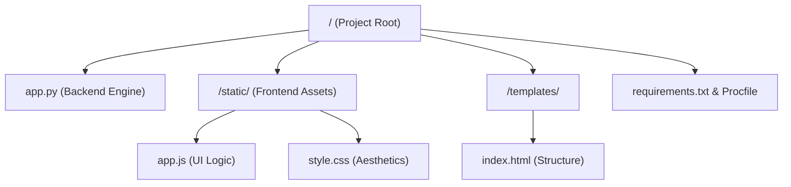
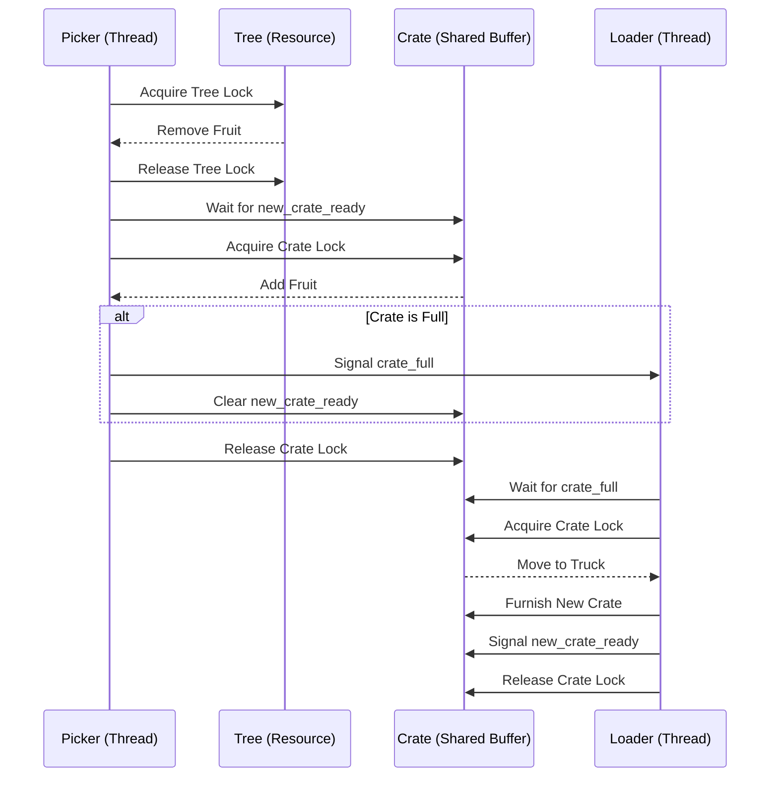

# Complex Engineering Project (CEP) Report

## Project Title: Spring Workers — Fruit Picking Simulation

**Domain:** Operating Systems & Parallel Computing

---

## 1. Executive Summary

The **Spring Workers** simulation is a real-time, web-based demonstration of fundamental Operating System concepts, specifically focused on **Process Synchronization**, **Mutual Exclusion**, and the **Producer-Consumer** pattern. The system simulates a fruit orchard where multiple "Picker" processes (threads) harvest fruits and a "Loader" process manages the logistics of shipping them in crates.

---

## 2. Project Architecture & File Structure

The project follows a standard Web-Backend architecture using Python (Flask) for the engine and Vanilla JavaScript for the visual real-time interface.

### 2.1 File Overview



---

## 3. Core OS Concepts Applied

### 3.1 Parallelism & Multithreading

The simulation uses Python's `threading` library to execute multiple agents concurrently:

- **Pickers (P1, P2, P3)**: Three independent threads simulating parallel processes.
- **Loader**: A separate logistics thread.
- **Flask Server**: Handles concurrent HTTP requests and Server-Sent Events (SSE).

### 3.2 Mutual Exclusion (Mutex)

To prevent race conditions on shared resources, `threading.Lock()` is utilized:

- **Tree Lock**: Only one picker can remove a fruit from the tree at a time.
- **Crate Lock**: Ensures that multiple pickers cannot modify the active crate simultaneously, and the loader cannot move the crate while a picker is adding fruit.

### 3.3 Signaling & Condition Synchronization

We use `threading.Event` to coordinate agent behavior:

- **`crate_full`**: Signaled by a picker to wake up the Loader.
- **`new_crate_ready`**: Signaled by the Loader to give pickers permission to resume filling.
- **`all_done`**: Signaled when the tree is bare to let the Loader wrap up.

---

## 4. Logical Workflow

### 4.1 The Producer-Consumer Pattern

The simulation is a classic variation of the Producer-Consumer problem:

- **Producers**: The Pickers harvest fruits (data) from the Tree (buffer 1) and place them into the Crate (buffer 2).
- **Consumer**: The Loader takes the full Crate and "consumes" it by moving it to the Truck.

### 4.2 Sequence Diagram



---

## 5. Implementation Deep Dive (Backend)

### 5.1 Real-time Communication (SSE)

The backend uses **Server-Sent Events (SSE)** via the `/stream` endpoint. This allows the server to "push" state changes (like `fruit_picked` or `lock_status`) to the frontend instantly, without the browser having to poll.

### 5.2 Robust Synchronization Fix

Throughout development, a critical race condition was identified where pickers could "overflow" a crate beyond its 12-slot capacity if they were already waiting for the lock.
**The Logic Fix:**

```python
while not placed and sim["running"]:
    sim["new_crate_ready"].wait() # Double-check condition
    with sim["crate_lock"]:
        if len(sim["crate"]) < CRATE_CAPACITY:
            # Atomic operation inside lock
            sim["crate"].append(fruit)
            placed = True
```

By placing the `wait` before the lock and the `len` check *inside* the lock, we ensure that no more than 12 fruits ever enter a crate, regardless of scheduling.

---

## 6. Deployment Strategy

### 6.1 Render (Recommended)

- **Engine**: Gunicorn with `eventlet` workers for async SSE handling.
- **Constraint**: Must use `--workers 1` because the simulation state is stored in memory (`sim` dictionary). Multiple workers would create isolated, inconsistent simulations.

### 6.2 PythonAnywhere

- **WSGI Integration**: Requires a custom WSGI file to expose the Flask `app` as `application`.
- **Limitation**: Free tier may experience timeouts on long-lived SSE connections.

---

## 7. Conclusion

The Spring Workers project successfully demonstrates how complex OS primitives come together to create a reliable, parallel system. The use of locks ensures data integrity, while signals facilitate efficient communication between independent execution units.
